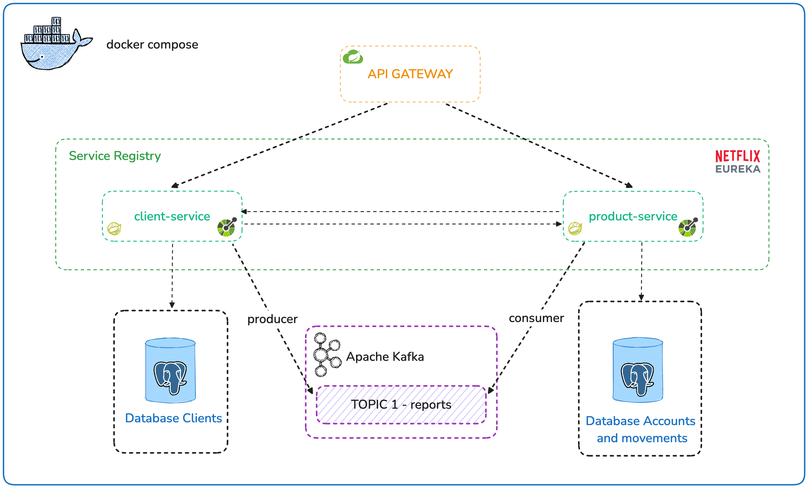
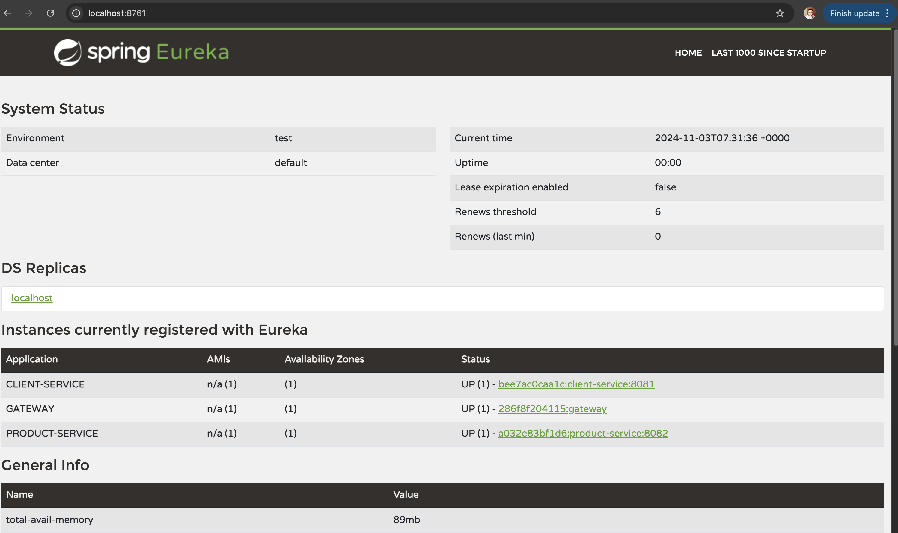
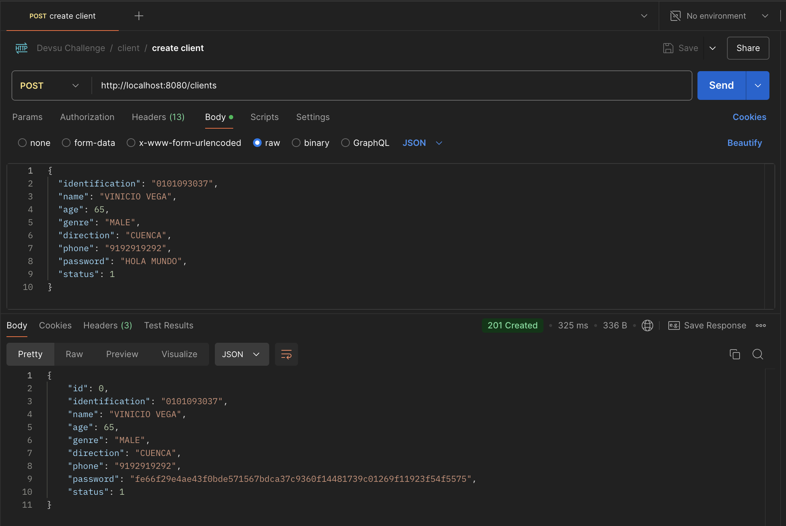

# devsu-bank-challenge

# Microservices Architecture with Docker Compose, Kafka, and Spring Cloud

## Overview

This microservices architecture enables the management of clients and account movements in a decoupled and scalable manner. It is designed to leverage asynchronous communication, service discovery, and load balancing to ensure high availability and scalability.



## Tools

This architecture uses the following tools:

- **Docker Compose**: To define and orchestrate multiple Docker containers, managing all necessary services for the system.
- **Spring Boot**: A framework for developing microservices with minimal configuration.
- **Spring Cloud**: To handle service discovery and load balancing.
- **Spring Cloud Netflix Eureka**: Used as a Service Registry, where microservices register and discover each other.
- **Spring Cloud Gateway**: Acts as an API Gateway, routing requests to the appropriate microservices and facilitating load balancing.
- **Apache Kafka**: Used for asynchronous communication between services, enabling publish-subscribe event creation for reports.
- **PostgreSQL**: Relational databases to store information about clients and account movements.

## Architecture Patterns

### Hexagonal Architecture

Each microservice follows the **Hexagonal Architecture** pattern, also known as **Ports and Adapters**. This pattern enables decoupling between business logic and input/output mechanisms, making testing and maintenance easier:

- **Ports (Interfaces)**: Ports define the operations that the service must offer or consume. In this case, `ClientIPort` and `ClientOPort` are examples of interfaces that allow specific logic implementation without affecting the core business logic.
- **Adapters**: Adapters are implementations of ports, such as `ClientService`, which interact with data and handle controller requests.

### Software Design Patterns

- **Builder**: Used to create complex object instances, such as `Client` and `ClientDto`, facilitating the creation of immutable objects.
- **Factory**: Allows the creation of specific object instances (e.g., mapping between DTOs and entities) without relying on concrete classes.
- **Strategy**: Used in report generation to decide which logic to apply depending on the movement or account type.

## Branch Management with Git Flow

We use **Git Flow** for branch management in this project. Git Flow provides a consistent branching model for managing feature development, releases, and hotfixes, making collaboration more organized and streamlined. The main branches used are:

- **main**: Contains stable, production-ready code.
- **develop**: The integration branch for feature development; contains code that will be merged into the main branch for future releases.
- **feature/***: Branches used for developing individual features.
- **release/***: Branches created for preparing a new production release.
- **hotfix/***: Branches used to fix urgent bugs in the main branch.

This branching model allows for parallel development and better control over the release process.


## API First Design

The architecture follows the **API First Design** principle. Each microservice defines its API contracts using OpenAPI. This approach enables the design and validation of APIs before writing code, ensuring that teams can develop and consume services with clear specifications.

## Asynchronous Communication with Kafka

### Kafka for Reporting

Apache Kafka is used for asynchronous communication between `client-service` and `product-service` in the report generation process. Kafka acts as an intermediary for publish-subscribe events:

- **Producer**: `client-service` acts as a producer and publishes events related to account reports on a Kafka topic.
- **Consumer**: `product-service` consumes these events and performs the necessary operations to process the reports. This approach allows decoupling of both services and efficient handling of high loads.

### Advantages

- **Scalability**: Kafka enables handling large volumes of data and processing events in parallel.
- **Decoupling**: Services do not directly depend on each other, reducing coupling and allowing each service to be modified independently.

## Scalability and Availability

### Service Registry (Eureka)

Each microservice registers with **Netflix Eureka** as a **Service Registry**. This allows services to discover each other without specific URLs, facilitating horizontal scaling and load balancing. The architecture allows multiple replicas of each service to handle traffic spikes.

### API Gateway

**Spring Cloud Gateway** acts as an **API Gateway** that:

- Manages request routing to the appropriate microservices.
- Facilitates load balancing among service instances.
- Provides a single entry point to all services, simplifying architecture and improving security.

This combination of **Service Registry** and **API Gateway** provides high availability and automatic load balancing, which enhances the architecture's scalability.

## How to Run

To build and run this architecture, follow these steps:

1. **Build Docker Images**: First, you need to build the Docker images for each microservice. Run the following commands:

   ```bash
   docker build -t client-service ./client-service
   docker build -t product-service ./product-service
   docker build -t eureka-server ./eureka-server
   docker build -t api-gateway ./api-gateway
   ```
2. **Start Services with Docker Compose**: Once the images are built, start the entire architecture using Docker Compose:
    
  ```bash
   docker-compose up
   ```

3. **Accessing Services**:

* **Eureka Dashboard**: Go to http://localhost:8761 to view the Eureka Service Registry and check if all services are registered.
* **API Gateway**: Access the API Gateway at http://localhost:8080, which will route requests to the appropriate microservices.

## Evidence



- **Postman Collection**: The Postman collection for testing the API endpoints is included in the project files. You can find it as `Devsu Challenge.postman_collection.json`. Import this file into Postman to test the available endpoints.


---
